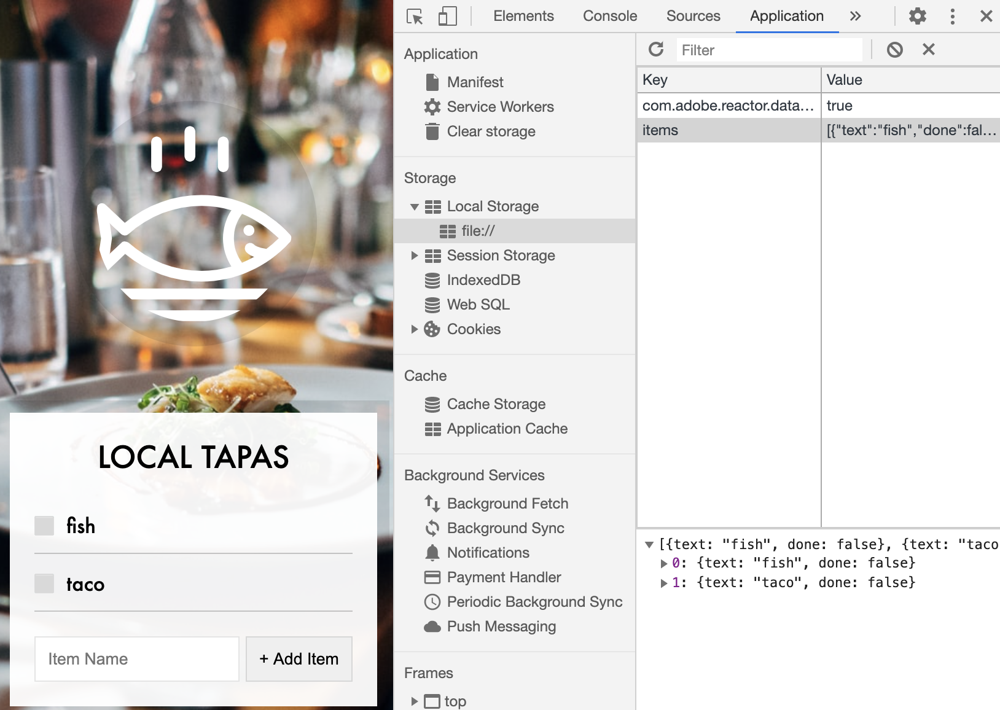

# Day15: Local Storage

### 문제 설명

- Local Storage

- Event Delegation

---

- preventDefault: 리로드(새로고침) 방지

  (cf) default: 새로고침 or 서버로 데이터 전달

- name 속성 가져오기

  ```javascript
  const text = this.querySelector("[name=item]").value;
  ```

- [HTMLFormElement.reset()](https://developer.mozilla.org/ko/docs/Web/API/HTMLFormElement/reset): 폼 리셋

⭐️ React, Angular와 같은 프레임워크 필요한 이유

- populateList 함수를 호출할 때마다(item 증가할 때마다) 매번 새롭게 전체 리스트가 생성(re-render)됩니다.

  => 리스트의 한 item만 업데이트하려면 React, Angular와 같은 프레임워크를 이용하여 _최소한의 HTML 변화_ 를 가져올 수 있습니다.


    ```javascript
    function addItem(e) {
        e.preventDefault();
        // console.log(this);
        const text = this.querySelector("[name=item]").value;
        const item = {
          text, // text: text in ES6
          done: false,
        };
        items.push(item);
        populateList(items, itemsList);
        localStorage.setItem("items", JSON.stringify(items));
        this.reset();
      }

    function populateList(plates = [], platesList) {
        platesList.innerHTML = plates
          .map((plate, i) => {
            return `
          <li>
            <input type="checkbox" data-index=${i} id="item${i}" ${
              plate.done ? "checked" : ""
            } />
            <label for="item${i}">${plate.text}</label>
          </li>
          `;
          })
          .join("");
      }
    ```

- CSS: checkbox icon customize

  ```css
  .plates input {
    display: none;
  }
  .plates input + label:before {
    content: "⬜️";
    margin-right: 10px;
  }
  .plates input:checked + label:before {
    content: "🌮";
  }
  ```

- [LocalStorage](https://developer.mozilla.org/ko/docs/Web/API/Window/localStorage): 브라우저 저장소

  - 특정 도메인에 따라 저장된 정보가 다릅니다.
  - 브라우저에 데이터를 저장할 수 있어, 새로고침 후에도 데이터가 손실되는 것을 방지합니다.

  - Chrome console - application - Local Storage에서 확인 가능
  - key-value 페어로 구성되고, **string** 타입으로 저장해야 합니다.
    => JSON.stringify 이용하여 localStorage에 저장하고, 사용할 때는 JSON.parse를 통해 원본 객체로 변환합니다.

    

- e.target.matches

- Event Delegation

  > 사용자의 액션에 의해 이벤트 발생 시 이벤트는 document 레벨까지 버블링 되어 올라간다. 이 때문에 자식 엘리먼트에서 발생하는 이벤트를 부모 엘리먼트에서도 감지할 수 있다. 이러한 동작을 이용해 사용할 수 있는 방법이 **이벤트 위임** 이다. 특정 엘리먼트에 각각 이벤트를 등록하지 않고 하나의 부모에 등록하여 부모에게 이벤트를 위임하는 방법이 바로 그것이다. (ref: https://ui.toast.com/weekly-pick/ko_20160826/)

  - 장점

  1. 동적인 엘리먼트에 대한 이벤트 처리, 이벤트 핸들러 관리 용이(동일한 이벤트에 대해 한 곳에서 관리하기 때문에 각각의 엘리먼트를 여러 곳에 등록하여 관리하는 것보다 관리가 용이)
  2. 상위 엘리먼트에서만 이벤트 리스너를 관리하기 때문에 하위 엘리먼트는 자유롭게 추가 삭제할 수 가능
  3. 메모리 사용량, 메모리 누수 가능성 감소

- 다른 프레임워크에서의 이벤트 위임

  > Backbone.js, Ember.js, React 같은 경우에는 내부적으로 이벤트 위임을 하기 때문에 자체적으로 제공하는 이벤트 등록 방식을 사용하면 된다. Angular.js의 경우는 별도의 모듈을 추가해 이벤트 위임을 할 수 있다.(ref: https://ui.toast.com/weekly-pick/ko_20160826/)

  1. where we listen for a click on something higher,
  2. and then inside of it we check if it's the actual thing that we want because it could trigger on a few different things

  ```javascript
  const itemsList = document.querySelector(".plates");
  const items = JSON.parse(localStorage.getItem("items")) || [];

  function toggleDone(e) {
    if (!e.target.matches("input")) return;
    //* skip unless it is input
    // If we click different items, the target is going to be different(items, checkbox, <li> ...etc)
    const el = e.target;
    const index = el.dataset.index;
    items[index].done = !items[index].done;
    localStorage.setItem("items", JSON.stringify(items));
    populateList(items, itemsList);
  }

  itemsList.addEventListener("click", toggleDone);
  ```

---

※ Reference

[JS localStorage](https://www.tiny.cloud/blog/javascript-localstorage/)

[localStorage 통한 목록관리](https://medium.com/@benjaminwoojang/localstorage%EB%A5%BC-%ED%99%9C%EC%9A%A9%ED%95%9C-%EB%AA%A9%EB%A1%9D-%EA%B4%80%EB%A6%AC-ed7c7aa9970b)

[이벤트 위임](https://ko.javascript.info/event-delegation)

[왜 이벤트 위임을 해야하는가?](https://ui.toast.com/weekly-pick/ko_20160826/)
