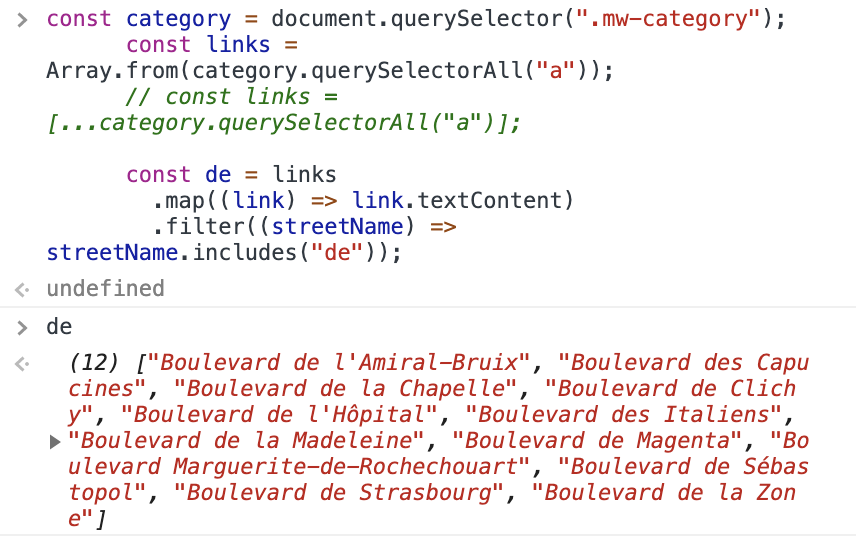

# Day3: Array Cardio day1

### 문제 설명

Array 메소드 정리

---

1. Array.filter: 주어진 함수의 테스트를 통과하는 모든 요소를 모아 새로운 배열로 반환

2. Array.map: 배열 내의 모든 요소 각각에 대하여 주어진 함수를 호출한 결과를 모아 **동일한 길이의 새로운 배열** 반환

3. Array.sort: 배열의 요소를 적절한 위치에 정렬한 후 그 배열을 반환

   - compareFuncion: 두 요소를 비교하는 함수 인자로 받음

4. Array.reduce: 배열의 각 요소에 대해 주어진 리듀서(reducer) 함수를 실행하고, 하나의 결과값을 반환

- NodeList => Array?

  1. Array.from()
  2. Spread Operator([...])

  ```javascript
  <!-- querySelectorAll: NodeList 반환 -->
  const links = category.querySelectorAll("a");

  <!-- 1. Array.from  -->
  const links = Array.from(category.querySelectorAll("a"));

  <!-- 2. Spread Operator  -->
  const links = [...category.querySelectorAll("a")];
  ```

  

- Destructuring(구조 분해 할당): 배열이나 객체의 속성을 해체하여 그 값을 개별 변수에 담을 수 있게 하는 JavaScript 표현식

  ```javascript
  const alpha = people.sort(function (lastOne, nextOne) {
    const [last, first] = lastOne.split(", ");
    console.log(last, first);
  });
  ```

- Reduce & Object

  - Sum up the instances of each of items
    (ex) {car: 5, truck: 3, bike: 2, walk: 2, van: 2}

    ```javascript
    const transportation = data.reduce((obj, item) => {
      if (!obj[item]) {
        obj[item] = 0; // set initialVal (ex) {car : 0}
      }
      obj[item]++; // increment value
      return obj;
    }, {});
    ```
